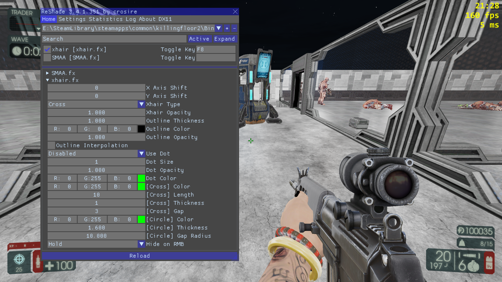
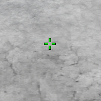
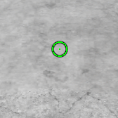
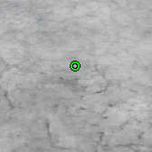
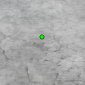
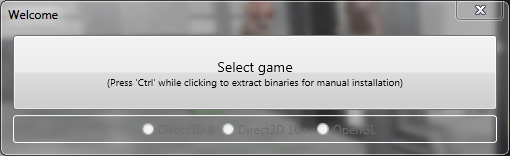

# reshade-xhair

A heavily customizable, fullscreen-compatible crosshair overlay shader.

| Feature             | Supported               |
| ------------------- | ----------------------- |
| Fullscreen          | :heavy_check_mark:      |
| No input lag        | :heavy_check_mark:      |
| No FPS impact       | :heavy_check_mark:      |
| Customizable        | :heavy_check_mark:      |
| One-time setup      | :heavy_check_mark:      |
| Automatic updates   | :heavy_check_mark: &#42; |

&#42; through the Steam Workshop (only for Killing Floor 2)

## FAQ

Q: Does this work in fullscreen?

A: Yes. Rather than rendering the crosshair outside the game, the injected ReShade overlay renders within the the game.

---

Q: Will this get me banned?

A: No, reshade-xhair will not get you banned by itself. **HOWEVER**, the program that it runs on (ReShade) is blacklisted by some games/anti-cheats. **Make sure you look up whether ReShade can be used safely on the desired game before installing it**.

Use at your own risk!

For EA games such as Battlefield 4, it is against ToS to use an overlay of any type. Punkbuster and Fairfight take screenshots of the overlay and could result in official action being taken to ban your account. Additionally third party anticheats such as GGC, ACI, PBBans and BF4DB will ban you for usage. 

Killing Floor 2 and PayDay 2 should be safe to use with.

---

Q: How do I uninstall?

A: Go to your game folder and delete any of the following files: `d3d8.dll`, `d3d9.dll`, `d3d10.dll`, `d3d11.dll`, `opengl.dll`, `dxgi.dll`.

---

Q: My game is crashing, how do I fix it?

A: Go to your game folder and rename `dxgi.dll` to `d3d11.dll`.

---

Q: I'm getting suttering/fps drops/misc issues

A: reshade-xhair is unlikely to be the issue. It's probably a ReShade issue. Google it.

## How to Install (for any game)

1. Download the latest version of the shaders (`shaders.zip`) from the [**Releases**](https://github.com/LouisTakePILLz/reshade-xhair/releases) tab on GitHub
2. Navigate to the folder that contains the **game executable** (e.g. `steamapps/common/killingfloor2/Binaries/Win64` for Killing Floor 2)
3. Extract the "shaders" folder (yes, the folder itself, **NOT the contents of it**) from `shaders.zip` to the game folder
4. Install ReShade from [reshade.me](https://reshade.me) (**ReShade 4.x is now supported!**).

    
    1. Click "Select game" and select your game executable (e.g. `steamapps/common/killingfloor2/Binaries/Win64/KFGame.exe` for Killing Floor 2)
    2. Check the appropriate game rendering API. If you don't know which one to pick, try the "Direct3D 10+" option.
    3. Click "No" when prompted with a "Yes/No" dialog about downloading standard shaders.
    4. Click "Edit ReShade settings".
        1. Change the "Effects Path" to the `shaders` folder (the same folder from **Step 3**)
        2. (optional) If you're familiar enough with ReShade, check "Skip Tutorial".
        3. Click "OK".
    5. Exit the ReShade installer.

5. Launch your game and open the ReShade overlay by pressing the "Home" key (or Shift-F2 for ReShade <4).
